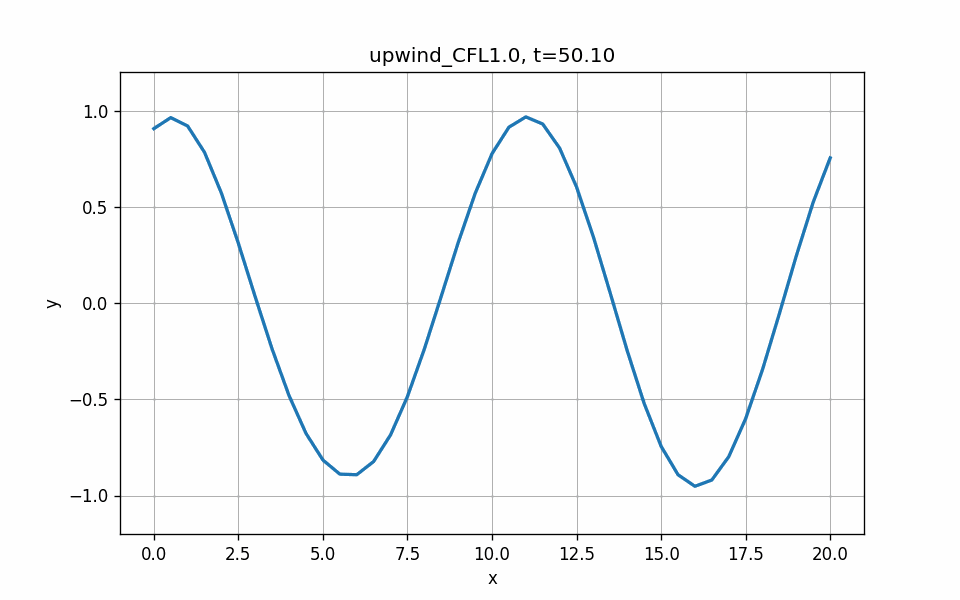
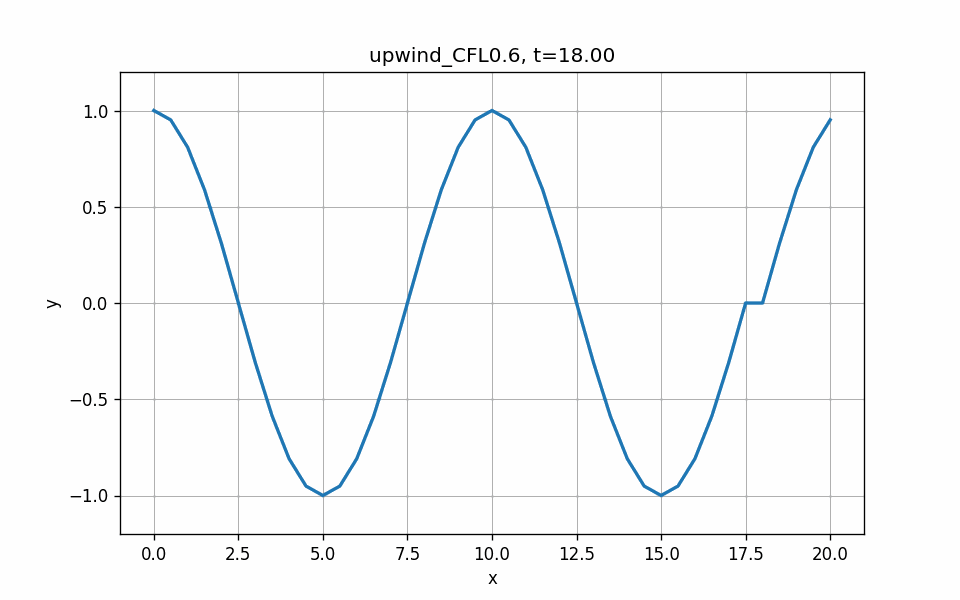
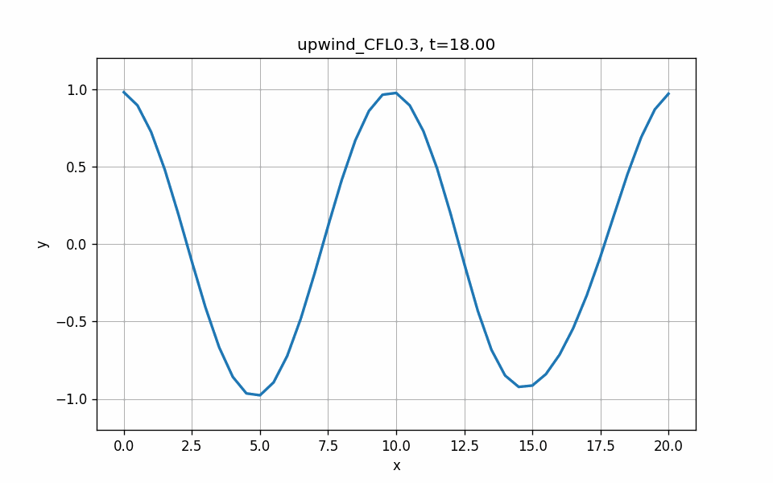
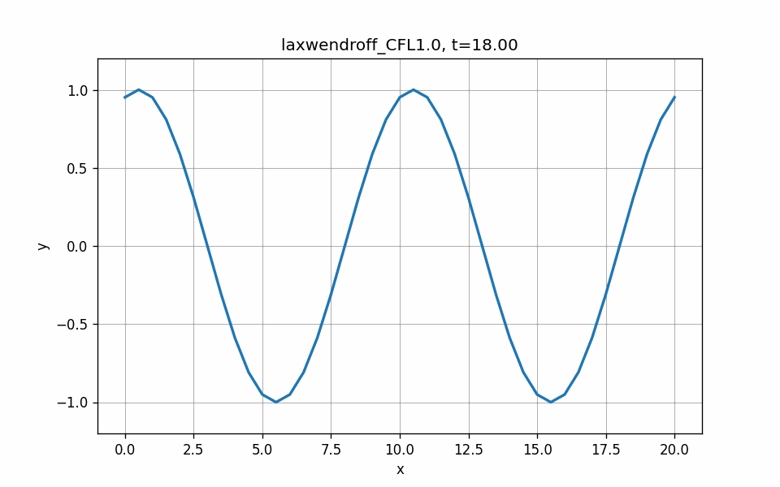
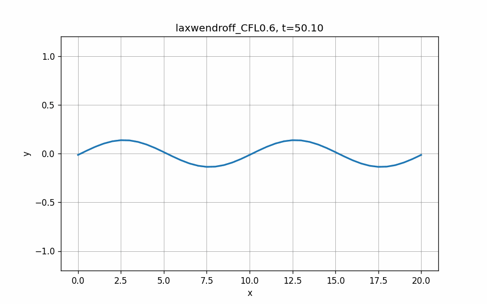
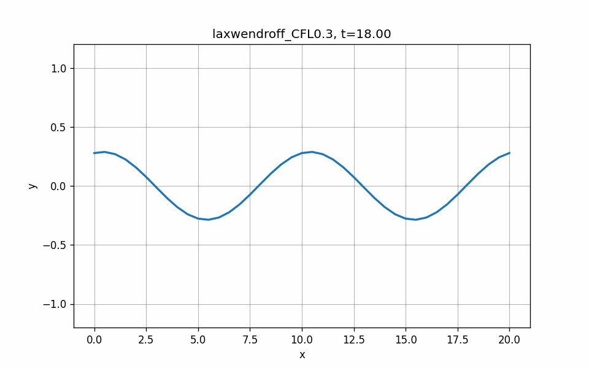

# Numerical Simulation of the 1D Linear Advection Equation  
### Upwind & Lax–Wendroff Schemes with GIF Visualization

This repository contains a complete implementation and visualization pipeline for solving the 1D linear advection equation:


\[
u_t + a u_x = 0,\quad a = 1,
\]


using two explicit finite‑difference schemes:

- **Upwind (уголок) scheme**
- **Lax–Wendroff scheme**

Both schemes are implemented with **periodic boundary conditions** and run for several Courant numbers (CFL):


\[
\frac{\tau}{h} = 1.0,\; 0.6,\; 0.3.
\]


The project automatically generates **smooth GIF animations** of the solution evolution without saving intermediate files.

---

## 📁 Repository Structure

.
├── solver.cpp               # C++ implementation of both schemes
├── solver                   # Compiled executable
├── graph.py                 # Python script that runs solver and generates GIFs
│
├── upwind_CFL0.3.gif        # GIF: Upwind scheme, CFL = 0.3
├── upwind_CFL0.6.gif        # GIF: Upwind scheme, CFL = 0.6
├── upwind_CFL1.0.gif        # GIF: Upwind scheme, CFL = 1.0
│
├── laxwendroff_CFL0.3.gif   # GIF: Lax–Wendroff scheme, CFL = 0.3
├── laxwendroff_CFL0.6.gif   # GIF: Lax–Wendroff scheme, CFL = 0.6
└── laxwendroff_CFL1.0.gif   # GIF: Lax–Wendroff scheme, CFL = 1.0

Код

---

# 🎥 GIF Animations

## Upwind Scheme

### CFL = 1.0


### CFL = 0.6


### CFL = 0.3


---

## Lax–Wendroff Scheme

### CFL = 1.0


### CFL = 0.6


### CFL = 0.3


---

## 🚀 Overview of the Numerical Method

### Spatial Grid
Uniform grid:


\[
x_i = i h,\quad i = 0,\dots,N,\quad h = \frac{L}{N}.
\]


### Initial Condition


\[
u(x,0) = \sin\left(\frac{4\pi x}{L}\right).
\]


### Boundary Conditions
Periodic:


\[
u(0,t) = u(L,t).
\]


### Courant Numbers
The solver runs simulations for:
- **CFL = 1.0**
- **CFL = 0.6**
- **CFL = 0.3**

These values demonstrate:
- CFL = 1.0 → perfect wave propagation (no diffusion)  
- CFL < 1 → numerical diffusion in upwind scheme  
- CFL small → strong damping (expected behavior)

---

## 🧮 Implemented Schemes

### 1. Upwind Scheme (уголок)


\[
u_i^{n+1} = u_i^n - \lambda (u_i^n - u_{i-1}^n)
\]


Properties:
- Stable for \(0 < \lambda \le 1\)
- Introduces **numerical diffusion**
- For small CFL (e.g., 0.3) the solution **decays toward zero** — this is expected

---

### 2. Lax–Wendroff Scheme


\[
u_i^{n+1} = u_i^n
- \frac{\lambda}{2}(u_{i+1}^n - u_{i-1}^n)
+ \frac{\lambda^2}{2}(u_{i+1}^n - 2u_i^n + u_{i-1}^n)
\]


Properties:
- Second‑order accurate
- No diffusion
- Has dispersive oscillations for small CFL

---

## 🖥 How the System Works

### 1. **C++ Solver (`solver.cpp`)**
- Computes the solution in time
- Outputs frames directly to **stdout** in a structured format:
SCHEME upwind CFL 0.6
FRAME t=0.0000
x0 y0
x1 y1
...
END

Код
- No intermediate files are created

### 2. **Python Script (`graph.py`)**
- Launches the solver via `subprocess`
- Reads frames from the output stream
- Converts each frame into an image (in memory)
- Assembles all frames into a **GIF animation**
- Saves only the final GIFs

---

## ▶️ How to Run

### 1. Compile the solver:
```bash
g++ solver.cpp -o solver -O3 -std=c++17
2. Run the visualization:
bash
python3 graph.py
3. Result
GIF files will appear in the repository directory:

Код
upwind_CFL0.3.gif
upwind_CFL0.6.gif
upwind_CFL1.0.gif
laxwendroff_CFL0.3.gif
laxwendroff_CFL0.6.gif
laxwendroff_CFL1.0.gif
📊 Interpretation of Results
Upwind Scheme
CFL = 1.0 → exact transport, no amplitude loss

CFL = 0.6 → moderate smoothing

CFL = 0.3 → strong damping (expected due to numerical diffusion)

Lax–Wendroff Scheme
CFL = 1.0 → accurate propagation

CFL = 0.6 → mild oscillations

CFL = 0.3 → stronger dispersive ripples

These behaviors match theoretical expectations.
