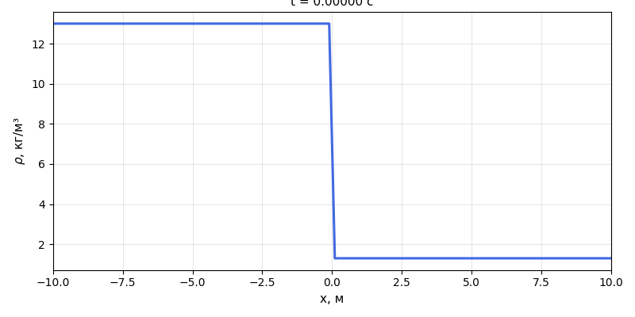
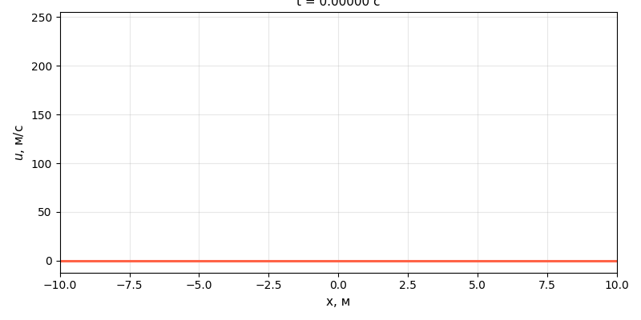
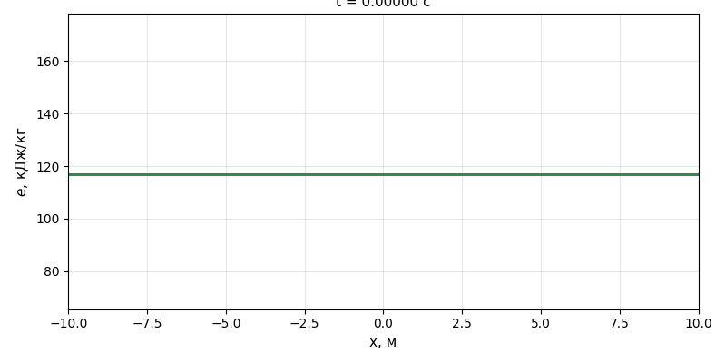
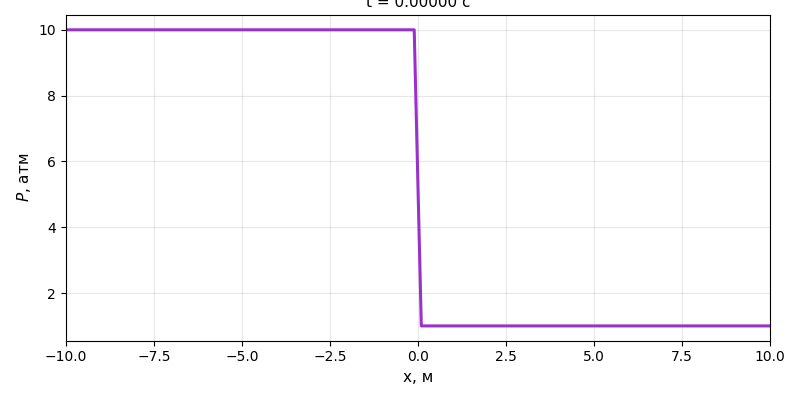
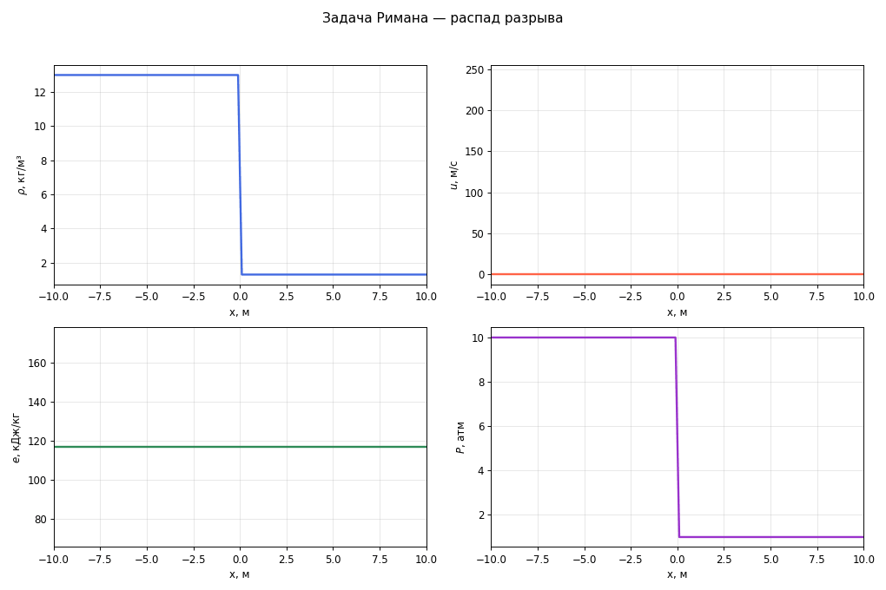

# 📘 Задача Римана о распаде разрыва

Численное решение задачи о распаде разрыва для одномерных уравнений газовой динамики с помощью схемы **Куранта–Изаксона–Риса (КИР)**.

---

## Постановка задачи

Рассматривается одномерная область $x \in [-10,\, 10]$ м, заполненная идеальным газом с показателем адиабаты $\gamma = 5/3$.  
В начальный момент $t = 0$ тонкая перегородка при $x = 0$ убирается. По обе стороны заданы различные термодинамические параметры:

| Параметр | Слева ($x < 0$) | Справа ($x > 0$) |
|----------|----------------|-----------------|
| $\rho$, кг/м³ | 13.0 | 1.3 |
| $u$, м/с | 0 | 0 |
| $P$, атм | 10 | 1 |

Задача решается до момента времени $t = 0.02$ с.

---

## Математическая модель

Система уравнений одномерной газовой динамики:

$$\frac{\partial \vec{w}}{\partial t} + A \frac{\partial \vec{w}}{\partial x} = 0, \qquad \vec{w} = (\rho,\, \rho u,\, \rho e)^T$$

Уравнение состояния идеального газа:

$$P = (\gamma - 1)\,\rho e$$

---

## Численная схема КИР

Разностная схема Куранта–Изаксона–Риса использует разложение матрицы $A = (\Omega^T)^{-1} \Lambda\, \Omega^T$ и расщепление по знаку собственных значений:

$$(\Omega^T)_i^n \frac{\vec{w}_i^{n+1} - \vec{w}_i^n}{\tau}
+ (\Lambda + |\Lambda|)_i^n \frac{\vec{w}_i^n - \vec{w}_{i-1}^n}{2h}
+ (\Lambda - |\Lambda|)_i^n \frac{\vec{w}_{i+1}^n - \vec{w}_i^n}{2h} = 0$$

Матрица $\Omega^T$ строится по формуле:

$$\Omega^T = \begin{pmatrix} -uc & c & \gamma-1 \\ -c^2 & 0 & \gamma-1 \\ uc & -c & \gamma-1 \end{pmatrix}$$

Условие устойчивости (число Куранта):

$$\mathrm{CFL} \equiv \frac{\tau \max_i |\lambda_i|}{h} \leq 1$$

В расчёте используется $\mathrm{CFL}_{\max} = 0.01$.

---

## Параметры расчёта

| Параметр | Значение |
|----------|---------|
| Число ячеек $NX$ | 100 |
| Начальный шаг $\tau_0$ | $10^{-7}$ с |
| $\mathrm{CFL}_{\max}$ | 0.01 |
| Конечное время | 0.02 с |
| Граничные условия | нулевой градиент |

---

## Результаты

### Плотность $\rho$



### Скорость $u$



### Удельная внутренняя энергия $e$



### Давление $P$



### Все переменные



---

## Структура репозитория

```
.
├── riemann_solver.cpp   # C++ решатель (схема КИР)
├── plot_results.py      # Python-скрипт для визуализации
├── README.md            # Описание задачи
└── output/
    ├── solution.csv         # Результаты расчёта
    ├── animation_all.gif    # Анимация всех переменных
    ├── anim_rho.gif         # Анимация плотности
    ├── anim_u.gif           # Анимация скорости
    ├── anim_ekJkg.gif       # Анимация внутренней энергии
    └── anim_Patm.gif        # Анимация давления
```

---

## Запуск

### 1. Компиляция и запуск C++ решателя

```bash
g++ -O2 -o riemann_solver riemann_solver.cpp
./riemann_solver
```

Результат сохраняется в `output/solution.csv`.

### 2. Визуализация

```bash
pip install pandas matplotlib pillow
python plot_results.py
```

GIF-анимации и графики сохраняются в папку `output/`.

---

## Зависимости

- **C++**: стандарт C++11 и выше, компилятор `g++`
- **Python**: `pandas`, `matplotlib`, `pillow`
